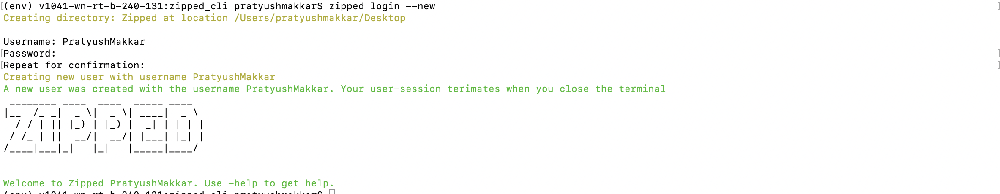
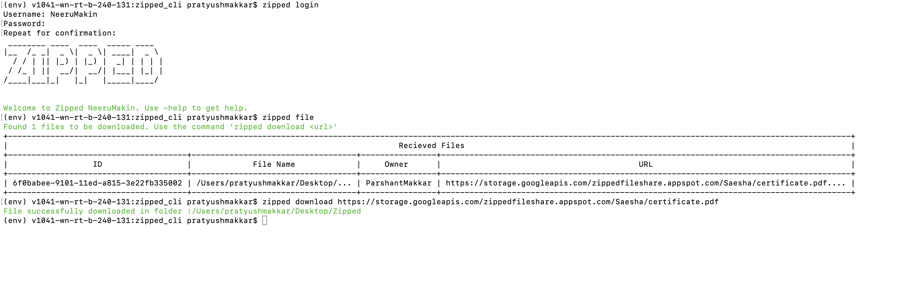
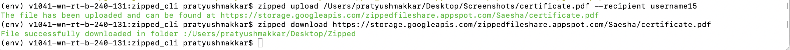
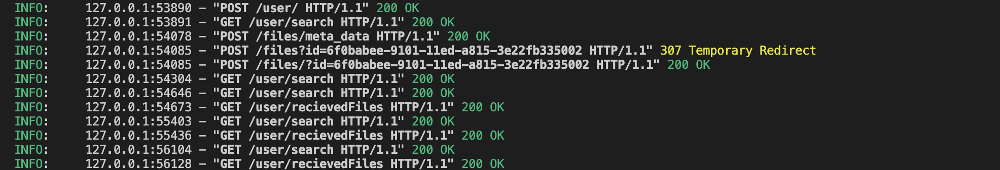

# :speech_balloon: Zipped Command Line 
Zipped Command Line is a software utility to share your files with anybody using the command line! 

The software is based on MongoDB, Firebase storage and using Python FastAPI for the backend server. 

If you have ideas to improve the software or add new features, feel free to create a pull request.


## :inbox_tray: Dependancies And Installation 
The service can be used as a pip package. First compile all the dependancies for the project. You can create a Click Command Line application by following these steps
1. <kbd>cd zipped_cli</kbd> 
2. <kbd>pip install editable .</kbd>

Verify that the tool is installed by using the command 

<kbd>zipped login</kbd>

You should then be prompted to login using a username and password. 


## :electric_plug: Tool Documentation
##### Creating a new user using Zipped login

To create a new user, simply use the command <kbd>zipped login --new</kbd>. You will then be prompted to create a user-id and password. Here is an example below,



Note that a new folder named <kbd>Zipped</kbd> will created in your home desktop. This folder will contain a configuration file named <kbd>config.json</kbd> 

##### Logging in using an existing user/password
To log in with an existing user ID, simply omit the <kbd>--new</kbd> flag. You will then be prompted to login and confirm your username and password.
 


##### Viewing recieved files
In the above example, we have also shown how to view files. Using the command <kbd>zipped file</kbd>. The file will contain a list including the URL, which can be used alongside the download command. 

##### Downloading a file using zipped download 
To download a file, use the command <kbd>zipped download {url}</kbd>. Here is an example below, 



The file is automatically added to your desktop folder <kbd>Zipped</kbd> and later deleted within the server. 
## :pushpin: Technical Documentation
The state date for each request is stored in an object named  ```Configuration``` class that is passed through the ```context``` object for each request.

```python
class Configuration(object):
    def __init__(self, _home, _path) -> None:
        self.home = _home
        self.path = _path
        self.configIO: ConfigIO = ConfigIO(path = _path)
        self.username = None
        self.password = None

```

For example, within the ```zipped file``` command, the stored context object retrieves the username and password from a config.json file stored in the home zipped folder. This decision is made to avoid forcing the user to pass the username and password with each request.
```python

@click.command()
@click.option("--count")
@click.pass_context
def file(ctx, count:int = 3):
    config: Configuration = ctx.obj
    _username, _password = SanitizeUsernameAndPassword(config)

```
It is worth noting that some commands can be run without authentication. For example ```zip download``` when provided with a valid URL will be able to download the file onto your computer into the designated folder.

```python
@click.command()
@click.option("--location", default = None)
@click.argument('url')
@click.pass_context
def download(ctx, location, url):

    if (not url):
        raise ZippedRuntimeException(detail= "A URL for the file must be specified")

    config: Configuration = ctx.obj
    _home = config.getHome()
    
```

To register the commands, a ```zipped``` group is made since all other commands access common zipped functionality. 

```python
import click 

@click.group()
@click.option("--home", default = _path)
@click.pass_context
def zipped(ctx, home: str):

    # If a home paramater is not specified then a dekstop Zipped folder created is used as home
    config_home = _CreateDesktopFolder()

```
To render the styled terminal ASCII art,   

```python
click.secho("The file has been uploaded and can be found at {0}".format(download_url), fg='green')
```
To understand API requests, refer to the folder <kbd>zipped_cli/api/</kbd>
```python
def POSTFileToServer(filepath: str, id: str):
    url = "{0}/{1}?id={2}".format(SERVER_URL, Resource._UPLOAD, id)

    with open(filepath, 'rb') as file:
        files = {'file' : file}
        response = requests.post(url, files=files)  
    return response
    

```
Here is a snapshot of the expected server requests, 


## :hammer_and_wrench: Contributing to the project
If you would like to contribute to the project, feel free to create a pull request. Make sure that all documentation is present for any changes.  
## :scroll: License
The library is licensed under <kbd>GNU GENERAL PUBLIC LICENSE</kbd>
